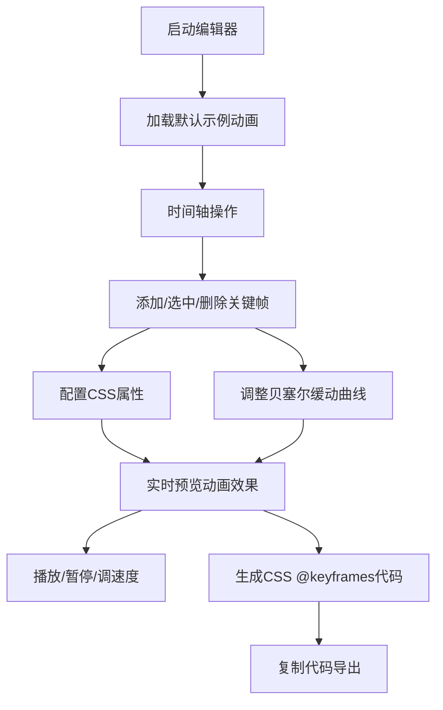

## 1. 产品概述

CSS动画编辑器是一款面向前端开发者和设计师的可视化动画创作工具，让用户无需手写复杂的@keyframes代码即可创建精美的CSS动画。通过直观的时间轴和属性面板，用户可以精确控制动画的每一个细节，实时预览效果，并一键导出标准CSS代码。

- 核心目标：降低CSS动画制作门槛，提升开发效率
- 目标用户：前端开发者、UI设计师、动效设计师
- 市场价值：填补纯前端CSS动画可视化编辑工具的空白

## 2. 核心功能

### 2.1 用户角色

| 角色 | 注册方式 | 核心权限 |
|------|----------|----------|
| 普通用户 | 无需注册，直接使用 | 全部编辑功能、代码导出 |

### 2.2 功能模块

1. **主编辑页面**：实时预览区、时间轴、属性配置面板、缓动曲线编辑器、代码导出区

### 2.3 页面详情

| 页面名称 | 模块名称 | 功能描述 |
|-----------|-------------|---------------------|
| 主编辑页面 | 实时预览区 | 居中展示动画元素，支持播放/暂停、速度调节、重置功能 |
| 主编辑页面 | 时间轴面板 | 底部横向时间轴，支持点击添加关键帧，拖拽调整关键帧位置，删除关键帧 |
| 主编辑页面 | 属性配置面板 | 右侧面板，配置选中关键帧的transform属性（位移x/y、旋转、缩放x/y、透明度） |
| 主编辑页面 | 缓动曲线编辑器 | 贝塞尔曲线可视化编辑，支持拖拽控制点，预设常用缓动函数 |
| 主编辑页面 | 代码导出区 | 实时生成标准CSS @keyframes代码，支持一键复制 |

## 3. 核心流程

用户打开应用后，默认看到一个带有关键帧的示例动画。用户可以：
1. 点击时间轴任意位置添加新关键帧
2. 选中关键帧后，在右侧面板调整该时刻的CSS属性
3. 通过贝塞尔曲线编辑器调整相邻关键帧之间的过渡效果
4. 使用播放控制实时预览动画
5. 复制生成的CSS代码应用到自己的项目中

## 4. 用户界面设计

### 4.1 设计风格

**设计主题：深色科技风（Dark Tech）**

- **主色调**：深灰蓝背景 `#0f172a`，面板背景 `#1e293b`
- **强调色**：霓虹青 `#22d3ee`（选中状态、时间轴标记）、霓虹紫 `#a855f7`（关键帧标记）
- **辅助色**：琥珀橙 `#f59e0b`（警告/操作按钮）、翠绿 `#10b981`（成功状态）
- **按钮风格**：圆角6px，微渐变背景，悬停有发光效果
- **字体**：标题使用 `Space Grotesk` 现代几何无衬线字体，正文使用 `JetBrains Mono` 等宽字体
- **布局风格**：三栏式布局（左预览、中时间轴、右属性）+ 底部缓动曲线编辑器
- **视觉效果**：玻璃拟态面板、细微边框光效、柔和阴影

### 4.2 页面设计概述

| 页面名称 | 模块名称 | UI元素 |
|-----------|-------------|-------------|
| 主编辑页面 | 实时预览区 | 居中画布、发光动画元素、浮动播放控制条（播放/暂停按钮、速度滑块、重置按钮、循环开关） |
| 主编辑页面 | 时间轴面板 | 百分比刻度标尺、可拖拽关键帧节点（菱形）、时间刻度点击热区、选中态高亮发光 |
| 主编辑页面 | 属性配置面板 | 分组卡片布局、数值滑块+输入框、单位标签、色值选择器 |
| 主编辑页面 | 缓动曲线编辑器 | SVG坐标系、可拖拽的两个贝塞尔控制点、曲线预览、预设按钮组（ease/linear/ease-in/ease-out/ease-in-out） |
| 主编辑页面 | 代码导出区 | 语法高亮代码块、复制按钮（成功提示）、代码折叠 |

### 4.3 响应式

- **Desktop-first**：默认桌面端三栏布局，最小宽度1280px
- **平板适配**：属性面板可折叠收起
- **移动端**：改为上下堆叠布局，预览区全屏可滑动

## 4.4 交互细节

- 关键帧节点拖拽时有吸附效果（5%步长）
- 属性数值变化时预览区同步即时渲染
- 贝塞尔曲线控制点拖拽显示实时坐标值
- 时间轴播放头随动画播放同步移动
- 复制代码按钮点击后显示"已复制"状态提示
