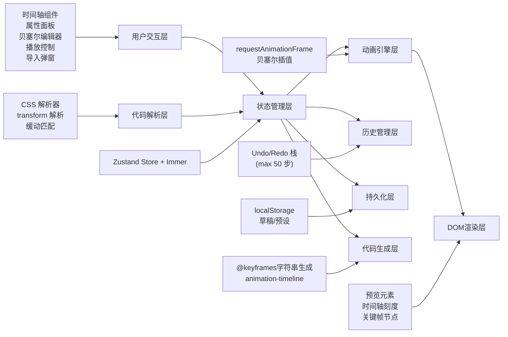

## 1. 架构设计



## 2. 技术描述

- **前端框架**：React@18.3.1
- **构建工具**：Vite@6.3.5
- **样式方案**：Tailwind CSS@3.4.0 + PostCSS
- **状态管理**：Zustand@5.0.3 + Immer（不可变更新）
- **不可变更新**：immer（用于历史记录快照）
- **图标库**：Lucide React@0.511.0
- **字体**：Space Grotesk + JetBrains Mono
- **持久化**：localStorage API
- **后端**：None（纯前端应用）

## 3. 路由定义

| 路由 | 目的 |
|-------|---------|
| / | 主编辑页面，包含所有功能模块 |

## 4. 核心数据结构

### 4.1 关键帧数据类型

```typescript
interface KeyframeProperties {
  translateX: number;      // px
  translateY: number;      // px
  rotate: number;          // deg
  scaleX: number;
  scaleY: number;
  opacity: number;         // 0-1
}

interface Keyframe {
  id: string;
  percent: number;         // 0-100，支持小数
  properties: KeyframeProperties;
  easing?: string;         // 兼容CSS导入的animation-timing-function
}
```

### 4.2 缓动函数类型

```typescript
interface EasingCurve {
  name: string;
  p1x: number; p1y: number;
  p2x: number; p2y: number;
}
```

### 4.3 草稿/预设类型

```typescript
interface SavedAnimation {
  id: string;
  name: string;
  type: 'draft' | 'preset';
  createdAt: number;
  updatedAt: number;
  data: {
    name: string;
    duration: number;
    keyframes: Keyframe[];
    easingCurves: Record<string, EasingCurve>;
    previewElement: PreviewElement;
  };
}
```

### 4.4 全局状态类型

```typescript
interface AnimationState {
  name: string;
  duration: number;
  keyframes: Keyframe[];
  selectedKeyframeId: string | null;
  selectedEasingPair: string | null;
  easingCurves: Record<string, EasingCurve>;
  snapEnabled: boolean;         // 吸附开关
  snapStep: number;             // 吸附步长，默认5%
  playback: {
    isPlaying: boolean;
    speed: number;
    loop: boolean;
    currentTime: number;
  };
  previewElement: PreviewElement;
  copied: boolean;
  importModalOpen: boolean;
  drafts: SavedAnimation[];
  presets: SavedAnimation[];
  showDraftPanel: boolean;
  // 历史记录
  past: AnimationState[];       // 撤销栈
  future: AnimationState[];     // 重做栈
}
```

## 5. 组件拆分

| 组件名 | 文件路径 | 职责 |
|--------|----------|------|
| PreviewCanvas | `src/components/PreviewCanvas.tsx` | 实时预览画布，动画播放引擎 |
| PlaybackControls | `src/components/PlaybackControls.tsx` | 播放控制条 |
| Timeline | `src/components/Timeline.tsx` | 时间轴，关键帧节点管理 |
| PropertyPanel | `src/components/PropertyPanel.tsx` | 属性配置面板 |
| BezierEditor | `src/components/BezierEditor.tsx` | 贝塞尔曲线可视化编辑器 |
| CodeExporter | `src/components/CodeExporter.tsx` | CSS代码生成、导入弹窗 |
| ImportModal | `src/components/ImportModal.tsx` | CSS导入弹窗 |
| DraftPanel | `src/components/DraftPanel.tsx` | 本地草稿/预设面板 |
| UndoRedoButtons | `src/components/UndoRedoButtons.tsx` | 撤销重做按钮 |
| cssGenerator | `src/utils/cssGenerator.ts` | @keyframes代码生成工具 |
| cssParser | `src/utils/cssParser.ts` | CSS @keyframes解析工具 |
| bezierUtils | `src/utils/bezierUtils.ts` | 贝塞尔曲线计算工具 |
| storage | `src/utils/storage.ts` | localStorage持久化工具 |
| animationStore | `src/store/animationStore.ts` | Zustand状态管理（含Undo/Redo） |

## 6. 关键实现方案

### 6.1 CSS @keyframes 解析器
```
解析流程：
1. 提取 @keyframes name { ... } 块
2. 用正则匹配 0%, 50%, 100%, from, to 等关键帧选择器
3. 解析每个关键帧块内的 CSS 属性：
   - transform: 提取 translate()/translateX()/translateY()/rotate()/scale()
   - opacity: 解析数值
   - animation-timing-function: 匹配预设或解析 cubic-bezier()
4. 对未声明的属性，在相邻关键帧之间插值补全
5. 根据关键帧数量自动生成 easingCurves
```

### 6.2 导出真实可用的多段缓动CSS
```
方案1（现代浏览器）：使用 animation-timeline + @property
- 用 @property 声明自定义 CSS 变量
- 每个关键帧段用独立的 @keyframes 配合 animation-range
- 缺点：兼容性有限（Chrome 115+）

方案2（兼容性更好）：使用 Web Animations API 或 JavaScript 注释
- 生成标准 @keyframes + animation 基础属性
- 额外生成多段动画的 JavaScript 代码块（可选）
- 在代码注释中提供各段缓动，便于用户手动拆分

方案3（最实用）：生成 SCSS/Less 变量 + mixin 版本
- 将各段缓动定义为变量
- 提供可直接使用的 mixin
- 同时保留标准 CSS 版本供参考

本项目采用【方案1 + 完整CSS注释】组合：
- 主输出为标准 @keyframes
- 额外提供 animation-timeline 版本代码块（可折叠）
- 详细标注每段缓动在CSS中的对应位置
```

### 6.3 Undo/Redo 实现
```
采用 Zustand + Immer 中间件：
1. 每次可撤销操作前，将当前状态深拷贝推入 past 栈
2. undo() 时：
   - 当前状态推入 future 栈
   - 从 past 栈顶部弹出作为新状态
3. redo() 时：
   - 当前状态推入 past 栈
   - 从 future 栈顶部弹出作为新状态
4. 新操作会清空 future 栈
5. 限制 past 栈最大长度为 50 条

可撤销操作类型：
- 添加/删除/移动关键帧
- 修改关键帧属性
- 修改缓动曲线
- 修改动画名称/时长
- 导入CSS（整体记录一步）
- 加载草稿/预设（整体记录一步）
```

### 6.4 关闭吸附与小数百分比
- 新增 `snapEnabled` 状态（默认 true）
- 关闭吸附时：
  - 拖拽关键帧使用精确位置（Math.round(percent * 100) / 100）
  - 显示关键帧百分比时保留2位小数
  - 添加关键帧时不做5%对齐
  - 时间轴刻度保持显示，但吸附提示隐藏
- 状态持久化到 localStorage

### 6.5 本地草稿与预设动画
- 使用 `localStorage` 存储：
  - `css_editor_drafts`: 用户保存的草稿
  - `css_editor_presets`: 内置预设（弹跳、淡入、旋转进入等）
- 首次加载时检查 localStorage，若无预设则初始化内置预设
- 草稿自动保存（防抖 1秒）或手动保存
- 支持：新建草稿、重命名、删除、加载、导出为 JSON
- 内置预设模板：
  1. bounceIn：弹跳进入
  2. fadeInUp：淡入上移
  3. spinIn：旋转进入
  4. pulse：呼吸脉冲
  5. shake：抖动效果
  6. float：上下漂浮
```
