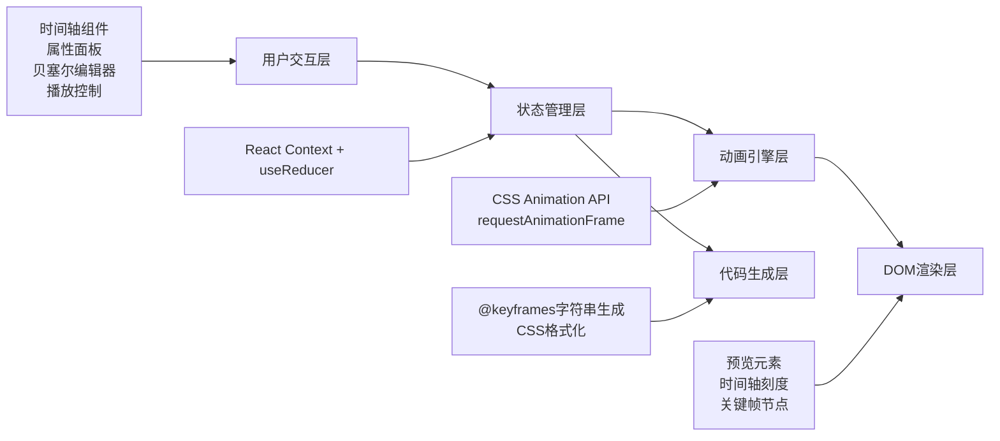

## 1. 架构设计



## 2. 技术描述

- **前端框架**：React@18.2.0
- **构建工具**：Vite@5.0.0
- **样式方案**：Tailwind CSS@3.4.0 + PostCSS
- **状态管理**：React Context + useReducer（无需第三方库）
- **图标库**：Lucide React
- **字体**：Space Grotesk（标题）、JetBrains Mono（代码/数值）
- **后端**：None（纯前端应用）
- **数据库**：None（本地状态，可选localStorage持久化）

## 3. 路由定义

| 路由 | 目的 |
|-------|---------|
| / | 主编辑页面，包含所有功能模块 |

## 4. 核心数据结构

### 4.1 关键帧数据类型

```typescript
interface Keyframe {
  id: string;
  percent: number; // 0-100
  properties: {
    translateX: number; // px
    translateY: number; // px
    rotate: number; // deg
    scaleX: number;
    scaleY: number;
    opacity: number; // 0-1
  };
}
```

### 4.2 缓动函数类型

```typescript
interface EasingCurve {
  name: string;
  p1x: number; // 贝塞尔控制点1 x (0-1)
  p1y: number; // 贝塞尔控制点1 y (0-1)
  p2x: number; // 贝塞尔控制点2 x (0-1)
  p2y: number; // 贝塞尔控制点2 y (0-1)
}
```

### 4.3 全局状态类型

```typescript
interface AnimationState {
  name: string; // 动画名称
  duration: number; // 秒
  keyframes: Keyframe[];
  selectedKeyframeId: string | null;
  easingCurves: Record<string, EasingCurve>; // key: fromKeyframeId-toKeyframeId
  playback: {
    isPlaying: boolean;
    speed: number; // 0.25 - 4
    loop: boolean;
    currentTime: number; // 0-100
  };
  previewElement: {
    width: number;
    height: number;
    borderRadius: number;
    background: string;
  };
}
```

## 5. 组件拆分

| 组件名 | 文件路径 | 职责 |
|--------|----------|------|
| App | `src/App.jsx` | 根组件，布局容器，状态初始化 |
| AnimationProvider | `src/context/AnimationContext.jsx` | 全局状态管理Context |
| animationReducer | `src/context/animationReducer.js` | 状态更新reducer函数 |
| PreviewCanvas | `src/components/PreviewCanvas.jsx` | 实时预览画布，动画播放引擎 |
| PlaybackControls | `src/components/PlaybackControls.jsx` | 播放控制条（播放/暂停/速度/重置/循环） |
| Timeline | `src/components/Timeline.jsx` | 时间轴，刻度渲染，关键帧节点管理 |
| KeyframeNode | `src/components/KeyframeNode.jsx` | 单个关键帧节点（可拖拽、点击选中） |
| PropertyPanel | `src/components/PropertyPanel.jsx` | 属性配置面板容器 |
| PropertySlider | `src/components/PropertySlider.jsx` | 通用数值滑块+输入框组件 |
| BezierEditor | `src/components/BezierEditor.jsx` | 贝塞尔曲线可视化编辑器 |
| CodeExporter | `src/components/CodeExporter.jsx` | CSS代码生成与导出区 |
| cssGenerator | `src/utils/cssGenerator.js` | @keyframes代码生成工具函数 |
| bezierUtils | `src/utils/bezierUtils.js` | 贝塞尔曲线计算工具函数 |

## 6. 关键实现方案

### 6.1 动画预览引擎
- 使用 `requestAnimationFrame` 驱动播放头更新
- 根据当前播放进度百分比，在相邻关键帧之间做属性插值计算
- 通过 `transform` + `opacity` 实时应用到预览元素上
- 播放速度通过调整每帧的时间步长实现

### 6.2 关键帧插值算法
```
对于任意属性 prop，当前进度 t（0-100%）：
1. 找到 t 所在的区间 [kf1, kf2]
2. 计算区间内相对进度：p = (t - kf1.percent) / (kf2.percent - kf1.percent)
3. 应用贝塞尔缓动函数：easedP = cubicBezier(p, p1x, p1y, p2x, p2y)
4. 线性插值：result = kf1.prop + (kf2.prop - kf1.prop) * easedP
```

### 6.3 时间轴拖拽
- 监听 `mousedown` → `mousemove` → `mouseup` 事件
- 将鼠标X坐标转换为时间轴百分比位置
- 拖拽时支持5%步长吸附
- 边界限制：不可超出0-100%范围，不可与相邻关键帧重叠

### 6.4 贝塞尔曲线编辑
- SVG渲染坐标系（x: 0-1, y: 0-1，映射到300x300画布）
- 控制点用 `<circle>` 渲染，支持 `onMouseDown` 拖拽
- 拖拽时实时更新贝塞尔路径
- 限制控制点x坐标范围在[0, 1]内
